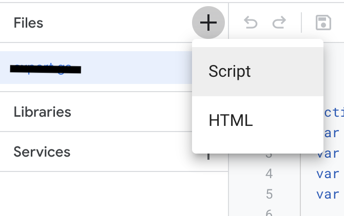
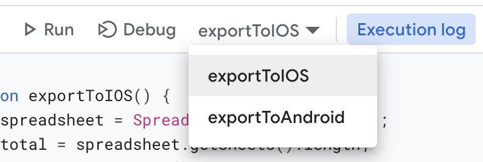
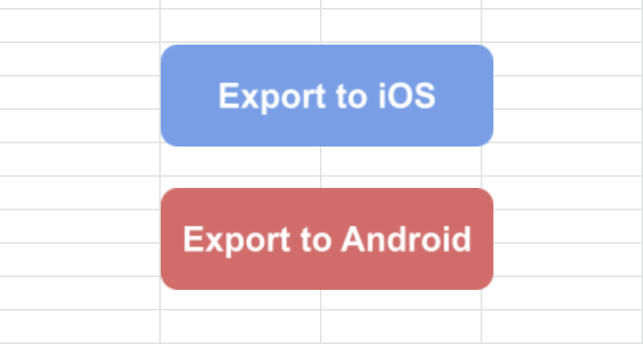
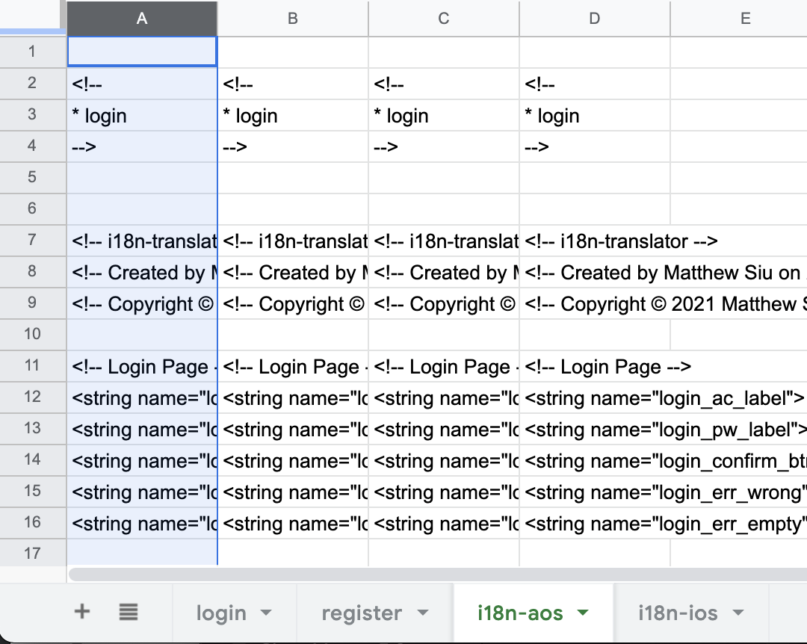
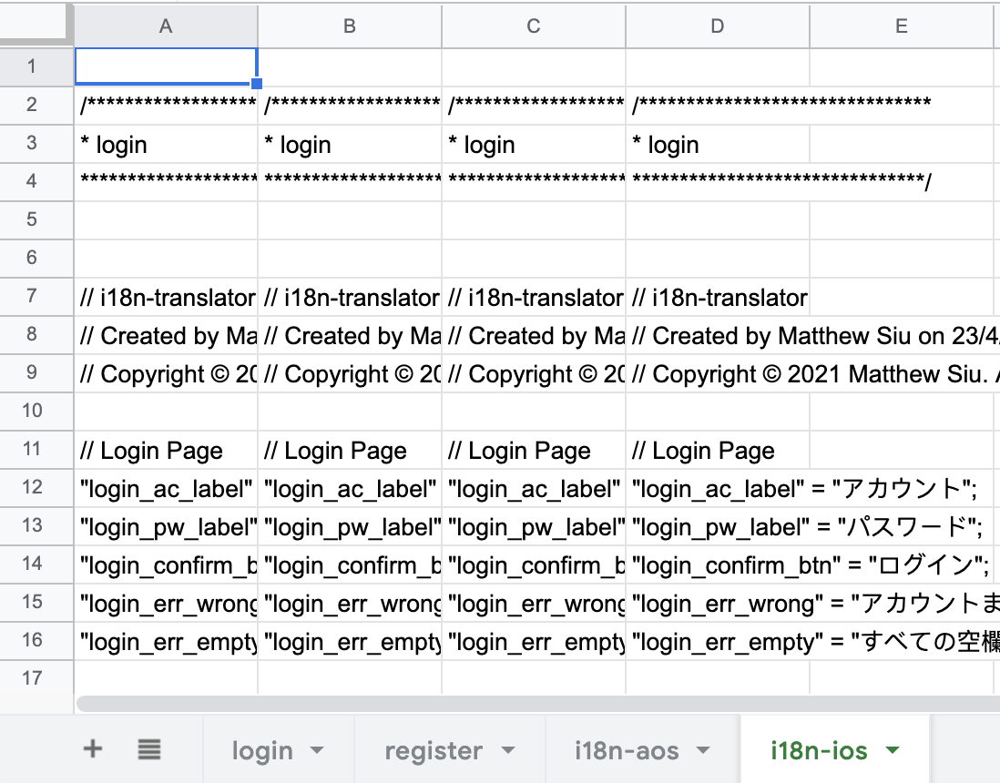
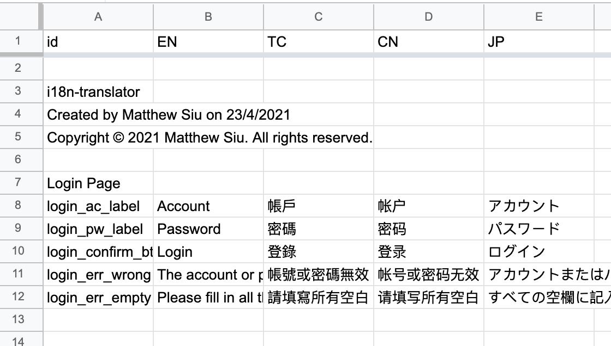

# i18n-googlesheet-translater

The application is used for converting the spreadsheet to native **iOS** (*.strings*) and **Android** (*.xml*) localization files.

## Setup

1. Create or open a spreadsheet in Google Sheets.

2. Add Google App Script Add-on. You may follow this link to finish the installation: https://developers.google.com/apps-script/guides/sheets/functions

3. Add scripts. Copy and paste the code in *main.gs* and *i18n-utils.gs* to the script.

4. Select the function you want to execute and click **Run**.

5. If you want to customize some buttons linking to those functions, you may follow this link: https://www.benlcollins.com/apps-script/google-sheets-button/.

## Outputs

After clicking **Run** or your custom button, you would have the i18n translation for
- Android format: *.xml*

- iOS format: *.strings*

Each column represents a localized script. Copy and paste to your project.

## Attentions

- Follow this pattern to edit the localization.

- You can create and edit more than one spreadsheet.

- Avoid naming the sheet with the word "i18n-". This is the exported sheet name for the corresponding OS.

- The program will take the number of language in first spreadsheet as the reference.
